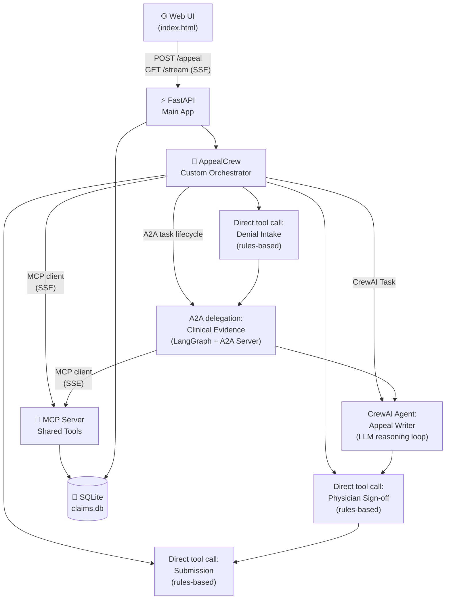
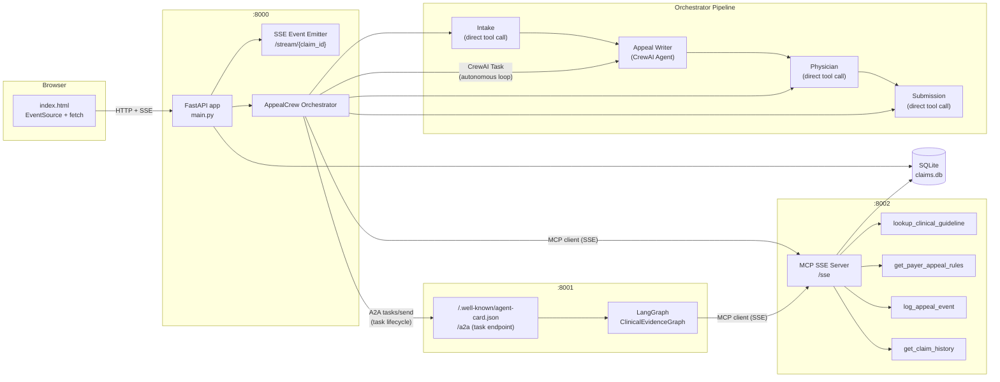
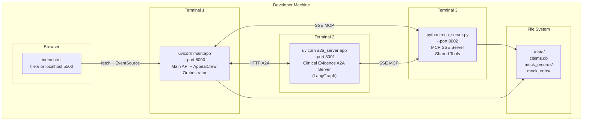
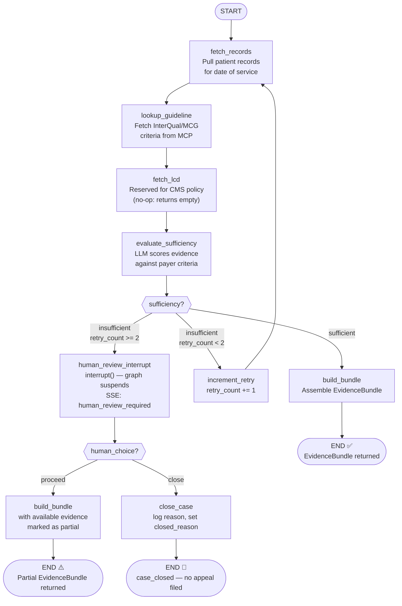
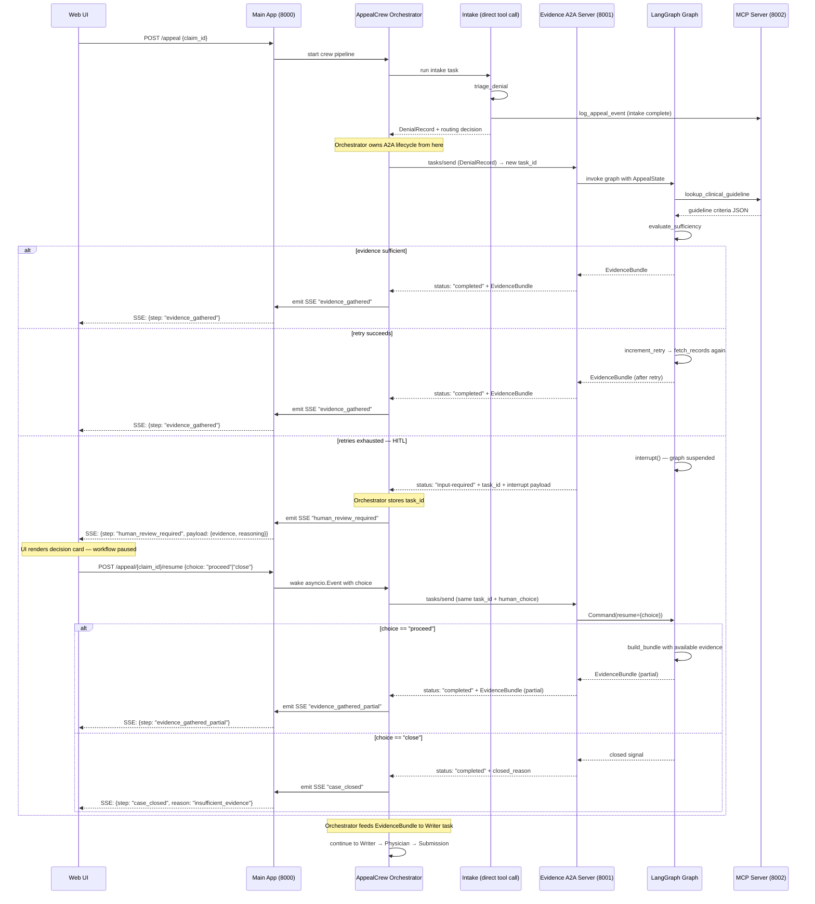
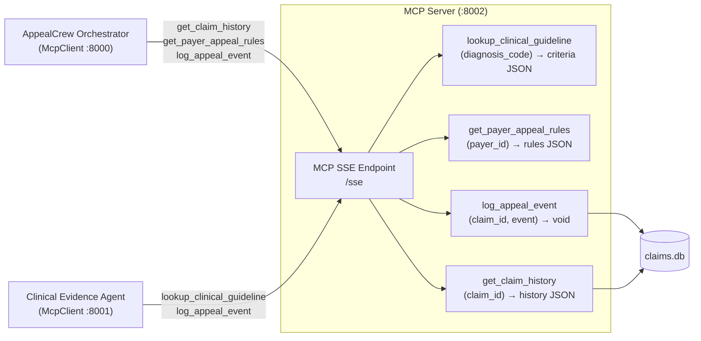
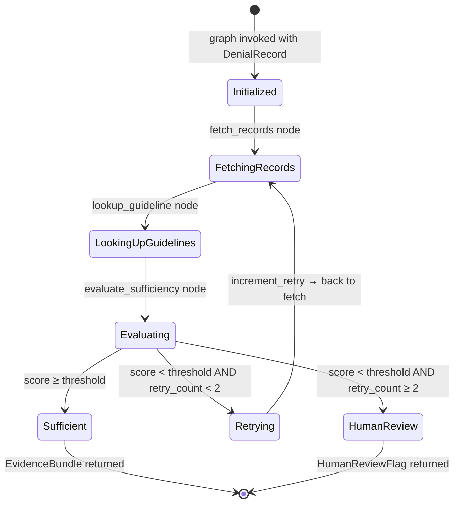
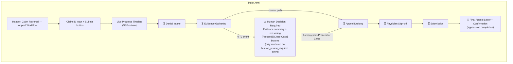

# Claim Reversal: A Multi-Agent Clinical Appeal Reversal System
## Technical Specification v0.3

> **Project type**: Side / learning project
> **Primary learning goals**: CrewAI orchestration, LangGraph conditional branching + HITL, A2A protocol, MCP shared tool layer, SSE-based real-time UI
> **Domain**: Healthcare Revenue Cycle Management — Clinical Denial Reversal

---

## Table of Contents

1. [Overview](#1-overview)
2. [Development Environment](#2-development-environment)
3. [Architecture Overview](#3-architecture-overview)
4. [System Architecture Diagram](#4-system-architecture-diagram)
5. [Deployment Diagram](#5-deployment-diagram)
6. [Agent Roster](#6-agent-roster)
7. [Agent Specifications](#7-agent-specifications)
8. [LangGraph Workflow — Clinical Evidence Agent](#8-langgraph-workflow--clinical-evidence-agent)
9. [A2A Integration](#9-a2a-integration)
10. [MCP Server — Shared Tool Layer](#10-mcp-server--shared-tool-layer)
11. [Tool Catalog](#11-tool-catalog)
12. [Data & State Design](#12-data--state-design)
13. [File System Layout](#13-file-system-layout)
14. [Frontend — Web UI with SSE](#14-frontend--web-ui-with-sse)
15. [Mock Data Strategy](#15-mock-data-strategy)
16. [Technology Decision Log](#16-technology-decision-log)
17. [Success Criteria](#17-success-criteria)
18. [Build Phases](#18-build-phases)

---

## 1. Overview

**Claim Reversal** is a multi-agent system that automates the clinical denial reversal workflow in healthcare revenue cycle management. When an insurer denies a hospital claim on clinical grounds (e.g., "not medically necessary"), the system orchestrates a coordinated sequence of agents to gather clinical evidence, draft a rebuttal appeal, obtain physician sign-off, and submit to the payer — all with real-time progress streaming to a browser-based UI.

The system is built as a learning vehicle for five specific patterns:

- **CrewAI** agents with autonomous tool-calling loops (Appeal Writer) within a custom async orchestrator
- **LangGraph** for conditional branching and a HITL pause inside the Clinical Evidence Agent
- **A2A protocol** to expose the Clinical Evidence Agent as a remote, independently deployable service
- **MCP** as a shared tool server providing cross-agent utilities (guideline lookup, audit log, payer rules)
- **SSE** for real-time workflow progress streaming to a single-file browser UI

All clinical data, payer responses, and external API calls are mocked. Mock data is hardcoded as realistic JSON fixtures (2 variants per data type for variety). LLM calls use **OpenRouter** with `openai/gpt-5-mini` for agent reasoning. No real EMR, payer portal, or HIPAA-regulated data is used.

---

## 2. Development Environment

### 2.1 Prerequisites

| Tool | Version | Notes |
|---|---|---|
| Windows | 10 or 11 | Host OS |
| Git Bash | Latest | Primary terminal — use instead of PowerShell or CMD for all commands in this spec |
| Python | ≥ 3.12 | Install via [python.org](https://www.python.org/downloads/) — ensure "Add to PATH" is checked during install |
| `uv` | Latest | Fast Python package manager — preferred over pip/venv for this project |
| OpenRouter account | — | Sign up at [openrouter.ai](https://openrouter.ai); used for LLM calls in agents |

### 2.2 Python Setup (Git Bash)

```bash
# Install uv (run in Git Bash)
curl -LsSf https://astral.sh/uv/install.sh | sh

# Verify
uv --version

# Create project and virtual environment
uv init claim-reversal
cd claim-reversal
uv venv --python 3.12   # or 3.13 — any version ≥ 3.12 works
source .venv/Scripts/activate   # Git Bash on Windows (not .venv/bin/activate)

# Install core dependencies
uv add fastapi uvicorn "langgraph>=1.2" "crewai[a2a]" "mcp>=1.27" openai httpx pydantic python-dotenv
```

> **Git Bash note**: Always use `source .venv/Scripts/activate` (not `Scripts\activate.bat`). If you see `python` not found after activation, use `python.exe` explicitly or add `.venv/Scripts` to your PATH in `.bashrc`.

### 2.3 Environment Variables

Create a `.env` file in the project root. Never commit this file.

```bash
# .env
OPENROUTER_API_KEY=sk-or-...

# Model routing
OPENROUTER_AGENT_MODEL=openai/gpt-5-mini   # CrewAI agent reasoning + evidence evaluation
OPENROUTER_GUARDRAIL_MODEL=openai/gpt-5.4-nano   # Input sanitization classifier (cheap, fast)

# Service ports
MAIN_APP_PORT=8000
EVIDENCE_AGENT_PORT=8001
MCP_SERVER_PORT=8002

# Feature flags
HITL_TIMEOUT_SECONDS=300   # How long to wait for human input before auto-closing
```

### 2.4 Running Services (Git Bash)

Open three separate Git Bash terminals:

```bash
# Terminal 1 — MCP server (start first, others depend on it)
cd claim-reversal
source .venv/Scripts/activate
python mcp_server/server.py

# Terminal 2 — Clinical Evidence A2A server
source .venv/Scripts/activate
uvicorn a2a_server.app:app --port 8001 --reload

# Terminal 3 — Main app
source .venv/Scripts/activate
uvicorn main:app --port 8000 --reload
```

Then open `frontend/index.html` directly in a browser (`file://`) or serve it:

```bash
# Terminal 4 (optional) — serve frontend
cd frontend
python -m http.server 5500
# Open http://localhost:5500/index.html
```

### 2.5 OpenRouter Setup

All LLM calls route through OpenRouter using the OpenAI-compatible SDK (`openai` Python package) with base URL `https://openrouter.ai/api/v1`.

A helper in `shared/llm.py`:
- `get_agent_llm()` — returns an OpenAI client + model name for agent reasoning (`OPENROUTER_AGENT_MODEL`)

CrewAI agents reference models using LiteLLM's OpenRouter prefix format: `llm="openrouter/openai/gpt-5-mini"`

---

## 3. Architecture Overview

The system is organized into three layers:

**Orchestration Layer** — A custom `AppealCrew` class (in `appeal_crew.py`) runs the sequential pipeline. It is **not** a standard CrewAI `Crew.kickoff()` because three hard constraints prevent it:

1. **HITL async pause** — The pipeline must suspend mid-execution (after evidence), wait for an HTTP POST from the browser, then resume. CrewAI tasks run to completion; there's no built-in way to park a crew on an `asyncio.Event`.
2. **Early termination** — If intake says "close" (non-clinical, deadline passed, low score), downstream tasks must be skipped. CrewAI sequential crews execute all tasks in order without conditional skipping.
3. **SSE substep granularity** — The UI needs 34 fine-grained events (`intake_parsing`, `intake_classifying`, etc.). CrewAI's `step_callback` fires per tool call, not at custom substep boundaries you control.

The orchestrator calls deterministic tools directly for rules-based steps (Intake, Physician, Submission), delegates to a **CrewAI Agent** for reasoning-heavy steps (Writer), and delegates to a remote **A2A server** for the Evidence Agent (LangGraph). A CrewAI agent's value is deciding which tool to call, with what arguments, and how to interpret the result — not just executing a fixed sequence. Steps that are purely rules-based (code lookups, date arithmetic, score formulas) gain nothing from an LLM reasoning loop.

**Intelligence Layer** — The Clinical Evidence Agent runs as a standalone A2A-compliant FastAPI server. Internally, it uses a LangGraph state graph with conditional edges to model the evidence gathering loop: search for records, evaluate sufficiency, retry if needed, escalate to human review if retries are exhausted.

**Shared Tool Layer** — A lightweight MCP server exposes shared tools that multiple agents consume: clinical guideline lookup, payer appeal rules, audit event logging, and claim history. Both the main app orchestrator and the A2A evidence server connect to the MCP server via SSE client protocol (`shared/mcp_client.py`). All tool calls route through port 8002 — no direct Python imports of tool implementations.

**Frontend** — A single-file HTML + vanilla JS web UI submits a claim ID and streams real-time progress events via SSE as the crew runs. No build step required.



---

## 4. System Architecture Diagram



---

## 5. Deployment Diagram

### 5.1 Local Development

All services run as separate processes on localhost, simulating a distributed system without cloud infrastructure.



### 5.2 Process Inventory

| Process | Contents | Port | Runtime | Notes |
|---|---|---|---|---|
| `main-app` | FastAPI app, AppealCrew orchestrator, CrewAI Writer agent, all local tools, SSE emitter | 8000 | Python / uvicorn | Entry point for all UI requests |
| `evidence-agent` | FastAPI A2A server, LangGraph graph, evidence tools | 8001 | Python / uvicorn | Simulates a remote organizational service |
| `mcp-server` | MCP SSE server, 4 shared tools, SQLite writes | 8002 | Python | Shared by main-app and evidence-agent |
| `frontend` | `index.html`, static JS, CSS | file:// or 5500 | browser | Single HTML file, no build step |
| SQLite (`claims.db`) | Appeals table + audit events table | — | File | Single DB, written by main-app and MCP server |

---

## 6. Agent Roster

| # | Agent Name | Execution Model | Local / Remote | Responsibility |
|---|---|---|---|---|
| 1 | Denial Intake | Direct tool call (rules-based) | Local | Triages the denial, classifies type, checks deadline, scores worthiness |
| 2 | Clinical Evidence Agent | LangGraph + A2A Server | **Remote (A2A)** | Gathers clinical records and guideline citations; loops until evidence is sufficient or escalates to human review |
| 3 | Appeal Writer Agent | **CrewAI Agent** (LLM loop) | Local | Autonomously drafts, validates, and retries the appeal letter until quality threshold is met |
| 4 | Physician Sign-off | Direct tool call (rules-based) | Local | Routes appeal for physician attestation if required; simulates approval |
| 5 | Submission | Direct tool call (rules-based) | Local | Submits the appeal to the payer and records the confirmation; workflow terminal point |

> **Design rationale**: Only the Writer benefits from a CrewAI agent's autonomous tool-calling loop — it must reason about quality, decide whether to retry, and incorporate validation feedback. Intake, Physician, and Submission are deterministic (code lookups, date arithmetic, score formulas) and gain nothing from an LLM reasoning loop. The Evidence Agent uses LangGraph instead of CrewAI because it needs state accumulation, conditional branching, and `interrupt()`-based HITL — patterns LangGraph handles natively.

---

## 7. Agent Specifications

### 7.1 Denial Intake

**Responsibility**: Entry point for the workflow. Receives denial data, classifies the denial type, validates the appeal window, and scores the claim for appeal worthiness. Outputs a `DenialRecord` with a routing decision.

**Execution model**: Direct tool call from orchestrator (no CrewAI agent). The logic is entirely rules-based — code-to-type mapping, date arithmetic, and threshold scoring — so an LLM reasoning loop would add latency and cost with no benefit.

**Tools**:
- `triage_denial` (local, sync) — accepts structured denial input + claim history (passed in by orchestrator), returns classification (clinical/admin), deadline status, and worthiness score in one call. Uses prior appeal history to penalize the worthiness score (e.g., `score -= 15` if a prior appeal for the same reason was already denied).
- `get_claim_history` (MCP, called by orchestrator) — retrieves prior denials and payments for the same claim. Orchestrator fetches via MCP client and passes result into `triage_denial` as a parameter.
- `log_appeal_event` (MCP, called by orchestrator) — writes intake event to audit log

**Inputs**: Structured denial JSON (claim ID, denial reason code, claim amount, payer ID, date of service) + claim history (from MCP)
**Outputs**: Structured `DenialRecord` + routing decision (proceed / close / skip)
**Decision logic**: If denial type ≠ clinical → exit workflow. If deadline passed → close. If worthiness score < threshold (accounting for prior appeal penalty) → close. Otherwise → proceed (orchestrator handles A2A delegation next).

---

### 7.2 Clinical Evidence Agent

**Responsibility**: Gathers all clinical documentation and guideline citations needed to support the appeal. Runs as an independent A2A-compliant server. Internally uses a LangGraph graph with a retry loop and conditional branching. See Section 8 for full detail.

**Framework**: LangGraph (internal) + FastAPI A2A Server (external interface)

**Tools**:
- `fetch_patient_records` (local to A2A server) — returns mock clinical notes and records
- `lookup_clinical_guideline` (MCP, via A2A server's own MCP client) — returns InterQual/MCG criteria for a diagnosis code. Called from async LangGraph nodes.
- `evaluate_evidence_sufficiency` (local) — LLM-scored check: does the gathered evidence meet the payer's criteria?
- `log_appeal_event` (MCP, via A2A server's own MCP client) — writes evidence events to audit log

**MCP client**: The A2A server holds its own `McpClient` instance (separate connection to :8002). LangGraph nodes are async and call MCP tools directly through this client.

**Inputs**: `DenialRecord` (claim ID, diagnosis codes, payer ID, denial reason)
**Outputs**: `EvidenceBundle` (records list, guideline citations, sufficiency verdict)
**Decision logic**: Handled by LangGraph graph — see Section 8.

---

### 7.3 Appeal Writer Agent

**Responsibility**: Autonomously drafts, validates, and iterates on the appeal letter until it meets a quality threshold. The agent owns the full draft→validate→retry loop — it decides when the letter is good enough.

**Execution model**: **CrewAI Agent** with autonomous tool-calling loop. This is the one step that genuinely benefits from an LLM reasoning loop: the agent must compose persuasive text, evaluate quality, interpret validation feedback, and decide whether to retry or accept. This is exactly what CrewAI agents do — decide which tool to call, with what arguments, and how to interpret the result.

**Tools** (pre-bound with context by the orchestrator):
- `draft_appeal_letter` (local) — LLM-powered composition; accepts denial context + evidence + payer rules + optional validation feedback. The orchestrator pre-binds `DenialRecord`, `EvidenceBundle`, and `payer_rules` into the tool closure so the agent calls it without passing complex objects.
- `validate_appeal_letter` (local) — LLM-as-judge scoring; checks evidence consistency, denial reason coverage, guideline citations, and required sections. Pre-bound with the same context.
- `log_appeal_event` (MCP, via orchestrator's MCP client) — writes drafting event to audit log. Pre-bound into tool closures so the agent doesn't manage the MCP connection.

**Inputs**: Task description from orchestrator containing denial context summary and instructions
**Outputs**: `AppealLetter` (formatted text, payer submission metadata)

**Agent behavior**: The task description instructs the agent: "Draft the letter, validate it, retry at most once if validation fails (score < 0.7), then return the best result." The agent autonomously:
1. Calls `draft_appeal_letter` to compose the initial letter
2. Calls `validate_appeal_letter` to score it
3. If score < 0.7: calls `draft_appeal_letter` again with validation issues as feedback
4. Returns the final `AppealLetter`

**SSE emission**: Tools emit SSE events directly (`drafting_composing`, `letter_validating`, `letter_validated`, `letter_drafted`) via a pre-bound queue reference. This is a minor violation of the "agents don't touch the queue" principle, but practical — the alternative (only emitting before/after the agent task) would lose the mid-loop timeline detail that makes the UI demo compelling.

---

### 7.4 Physician Sign-off

**Responsibility**: Determines if physician attestation is required for this appeal. If yes, simulates physician review and approval (always approves). If not required, passes through immediately. Kept as a distinct step to maintain 1:1 mapping between workflow stages and SSE timeline visibility.

**Execution model**: Direct tool call from orchestrator (no CrewAI agent). The decision is entirely rules-based (`if clinical AND (amount >= $10k OR payer in {BCBS, UHC}) → required`). Approval is always simulated — there is no reasoning to perform.

**Tools**:
- `physician_review` (local) — rules-based check: returns `{required: bool, status: "approved"}`. Always approves — this is a simulated step, not a real HITL point.
- `log_appeal_event` (MCP) — writes sign-off event to audit log

**Inputs**: `AppealLetter` + `DenialRecord`
**Outputs**: `PhysicianReview` (required status + approval)
**Decision logic**: If physician required → simulate approval, log event. If not required → pass through unchanged. No branching, no failure path.

---

### 7.5 Submission

**Responsibility**: Submits the appeal to the payer through the required channel. Records the submission confirmation. This is the terminal step.

**Execution model**: Direct tool call from orchestrator (no CrewAI agent). Submission is pure I/O — generate a confirmation number and persist to the database. No reasoning involved.

**Tools**:
- `submit_appeal` (local, sync) — simulates submission to payer portal; accepts appeal letter + payer rules (passed in by orchestrator); returns a confirmation number and timestamp
- `get_payer_appeal_rules` (MCP, called by orchestrator) — retrieves submission format and method for the payer. Orchestrator fetches via MCP client and passes result into `submit_appeal` as a parameter.
- `log_appeal_event` (MCP, called by orchestrator) — writes submission event to audit log

**Inputs**: `AppealLetter` + `DenialRecord` + payer rules (from MCP)
**Outputs**: `SubmissionConfirmation` (confirmation number, submitted_at, payer_id, method)
**Decision logic**: None — linear execution. Always submits if it receives a letter.

---

## 8. LangGraph Workflow — Clinical Evidence Agent

### 8.1 State Schema

```python
from typing import TypedDict, Optional, List
from enum import Enum

class EvidenceSufficiency(str, Enum):
    SUFFICIENT = "sufficient"
    INSUFFICIENT = "insufficient"
    HUMAN_REVIEW = "human_review"

class HumanChoice(str, Enum):
    PROCEED = "proceed"
    CLOSE = "close"

class AppealState(TypedDict):
    # Input
    claim_id: str
    diagnosis_codes: List[str]
    payer_id: str
    denial_reason_code: str

    # Gathered evidence
    patient_records: Optional[List[dict]]
    guideline_citations: Optional[List[dict]]
    lcd_policy_text: Optional[str]           # reserved for future CMS policy lookup

    # Evaluation
    sufficiency: Optional[EvidenceSufficiency]
    sufficiency_reasoning: Optional[str]
    retry_count: int
    include_supplemental: bool              # set True by increment_retry; fetch_records returns additional records

    # HITL
    human_choice: Optional[HumanChoice]   # set by interrupt() resume
    hitl_triggered: bool                  # flag for SSE emission

    # Output
    evidence_bundle: Optional[dict]
    closed_reason: Optional[str]
    error: Optional[str]
```

### 8.2 Graph Definition



### 8.3 Node Descriptions

| Node | Description |
|---|---|
| `fetch_records` | Calls `fetch_patient_records` tool; populates `patient_records` in state. When `include_supplemental == True`, mock returns 1–2 additional records (e.g., specialist consult, additional imaging) |
| `lookup_guideline` | Async node; calls MCP `lookup_clinical_guideline` via the A2A server's MCP client with diagnosis codes; populates `guideline_citations` |
| `fetch_lcd` | Calls `fetch_lcd_policy` (no-op: returns empty string); populates `lcd_policy_text`. Reserved for future CMS policy lookup |
| `evaluate_sufficiency` | LLM call: given records + guidelines, score whether medical necessity is demonstrated |
| `increment_retry` | Increments `retry_count`; sets `include_supplemental = True` so next fetch returns broader records |
| `human_review_interrupt` | Calls `interrupt()` with evidence summary and sufficiency reasoning; sets `hitl_triggered = True`; graph suspends here until resumed |
| `build_bundle` | Packages gathered evidence into `EvidenceBundle`; marks `partial=False` |
| `build_bundle_partial` | Same as above but marks `partial=True`; appeal letter will note incomplete evidence |
| `close_case` | Sets `closed_reason = "insufficient_evidence_human_closed"`; no bundle produced |

### 8.4 Conditional Edge Logic

```python
def route_after_evaluation(state: AppealState) -> str:
    if state["sufficiency"] == EvidenceSufficiency.SUFFICIENT:
        return "build_bundle"
    elif state["retry_count"] >= 2:
        return "human_review_interrupt"
    else:
        return "increment_retry"

def route_after_hitl(state: AppealState) -> str:
    if state["human_choice"] == HumanChoice.PROCEED:
        return "build_bundle_partial"
    return "close_case"
```

### 8.5 HITL Implementation

**Mechanism**: LangGraph's `interrupt()` (from `langgraph.types`) suspends the graph and returns control to the caller. The A2A server catches the suspension, returns `status: "input-required"` to the orchestrator, and holds state in a `MemorySaver` checkpointer (from `langgraph.checkpoint.memory`). The orchestrator then pushes the `human_review_required` event to the SSE queue (see Section 14.3 for SSE emission architecture).

**Interrupt payload**: The `human_review_interrupt` node calls `interrupt()` with a dict containing:
- `claim_id`, `sufficiency_reasoning`
- `evidence_gathered` (record count, guideline count)
- `options`: `["proceed", "close"]`

The return value of `interrupt()` is whatever the caller passes via `Command(resume=...)`.

**Resume endpoint**: `POST /appeal/{claim_id}/resume` accepts the human's choice, then calls `graph.invoke(Command(resume={...}), config={"configurable": {"thread_id": claim_id}})` to resume the graph from the exact point of suspension.

**Timeout**: If no human response is received within `HITL_TIMEOUT_SECONDS` (default 300s from `.env`), the main app automatically resumes with `choice = "close"` to prevent indefinite hanging. Timeout fires a `case_closed` SSE event with `reason=timeout`.

---

## 9. A2A Integration

### 9.1 Overview

The Clinical Evidence Agent runs as a standalone FastAPI server that exposes an A2A-compliant interface. The orchestrator (in `appeal_crew.py`) manages A2A communication directly — sending tasks, handling the `input-required` HITL signal, and resuming after human input. This simulates a real organizational boundary — the evidence service could be maintained by a different team or run in a different environment.

A2A delegation is an **orchestrator-level concern**, not an agent-level concern. The Intake step triages and outputs a `DenialRecord`; the orchestrator then sends it to the Evidence Agent via A2A as the next step in the pipeline.

### 9.2 A2A Server Configuration

The Clinical Evidence Agent is exposed as an A2A server using CrewAI's `A2AServerConfig` (from `crewai.a2a`). It binds to port 8001 and serves its agent card at `/.well-known/agent-card.json`. The server configuration specifies the agent's role, goal, LLM, and tool list. No authentication is needed for local development.

### 9.3 A2A Client Configuration (AppealCrew orchestrator)

The orchestrator connects to the remote evidence agent using `httpx.AsyncClient` with the A2A protocol's `tasks/send` endpoint. Configuration:

| Parameter | Value | Purpose |
|---|---|---|
| `agent_card_url` | `http://localhost:8001/.well-known/agent-card.json` | Discovery — fetched once at startup to resolve the task endpoint |
| `task_endpoint` | `http://localhost:8001/a2a` | Resolved from agent card; used for `tasks/send` |
| `timeout` | 120 seconds | Max wait per individual `tasks/send` request (not total HITL wait) |
| `fail_fast` | `False` | If the remote agent is unreachable, orchestrator emits SSE error and terminates gracefully — no crash |

### 9.4 Delegation Sequence

> **Reading the diagram**: `alt` blocks represent alternative paths (like if/else). Only one path executes per run depending on the evidence sufficiency outcome.



### 9.5 HITL Handoff via A2A Task Lifecycle

When the LangGraph `interrupt()` fires inside the Evidence Agent, the A2A server must signal this back to the orchestrator without blocking an HTTP connection for minutes. The A2A protocol's task lifecycle handles this natively.

**Sequence:**

1. Orchestrator sends initial `tasks/send` to A2A server with the `DenialRecord` payload. A new `task_id` is generated server-side.
2. A2A server invokes the LangGraph graph. If evidence is sufficient, it returns immediately with `status: "completed"` + `EvidenceBundle`. **Normal path ends here.**
3. If the graph hits `interrupt()`, the A2A server returns `status: "input-required"` with:
   - The same `task_id`
   - A `message` containing the interrupt payload (evidence summary, sufficiency reasoning, options: `["proceed", "close"]`)
4. **Orchestrator stores the `task_id`** from this response. This is critical — it's the correlation key for resuming the suspended graph.
5. Orchestrator emits SSE `human_review_required` to the browser and awaits on a per-claim `asyncio.Event`.
6. Human POSTs to `POST /appeal/{claim_id}/resume` with `{ choice: "proceed" | "close" }`. The main app sets the event.
7. Orchestrator wakes, sends a **second `tasks/send`** to the A2A server with:
   - The **same `task_id`** from step 4
   - A message containing `{ "human_choice": "proceed" | "close" }`
8. A2A server uses the `task_id` to look up the checkpointed thread, calls `graph.invoke(Command(resume={"choice": ...}), config={"configurable": {"thread_id": task_id}})`.
9. Graph completes → A2A server returns `status: "completed"` with either an `EvidenceBundle` (partial) or a `ClosedByHuman` signal.
10. Orchestrator continues to the Writer task (or terminates the workflow if closed).

**Key implementation details:**

| Concern | Resolution |
|---|---|
| `task_id` storage | Orchestrator holds `task_id` in a local variable between steps 4 and 7. Not persisted — if the main app crashes, the workflow is lost (acceptable for a learning project). |
| Thread ID ↔ task_id mapping | The A2A server uses `task_id` as the LangGraph `thread_id` in the `MemorySaver` checkpointer. One-to-one mapping, no separate lookup table needed. |
| Timeout ownership | The **main app** owns the timeout. If `HITL_TIMEOUT_SECONDS` elapses without a human response, the orchestrator sends the second `tasks/send` with `choice: "close"` and `reason: "timeout"`. The A2A server doesn't track time. |
| Connection failure on resume | If the second `tasks/send` fails (A2A server restarted), the `MemorySaver` state is lost (in-memory only). The orchestrator emits SSE `error` and terminates. Acceptable for local dev. |

**A2A response shape when suspended:**

The A2A server returns a task object with `status.state` set to `"input-required"`. The response includes the server-generated `task_id` at the top level. The `messages` array contains a single agent message with one `data` part. The data part carries: `claim_id`, `sufficiency_reasoning` (the agent's explanation of why evidence is insufficient), `evidence_gathered` (an object with `record_count` and `guideline_count` — what was found so far), and `options` (a list of valid human choices: `["proceed", "close"]`).

**Resume message shape (second `tasks/send`):**

The orchestrator sends a task object with the **same `id`** (the `task_id` stored from the first response). The `messages` array contains a single user message with one `data` part. The data part carries a single field: `human_choice` set to either `"proceed"` or `"close"`.

---

### 9.6 Agent Card (`.well-known/agent-card.json`)

The agent card follows A2A protocol v0.3.0. It declares:

- **Name & description**: "Clinical Evidence Agent" — gathers and evaluates clinical evidence
- **URL**: `http://localhost:8001`
- **Input/Output modes**: `application/json`
- **Skills**: One skill — `clinical_evidence_gathering` — accepts a denial record (diagnosis codes + payer ID) and returns an evidence bundle

---

## 10. MCP Server — Shared Tool Layer

### 10.1 Overview

The MCP server is a lightweight process built with the `mcp` Python SDK (FastMCP) using SSE transport. It exposes four tools consumed by multiple agents. Running it as a shared service rather than duplicating tool logic in each agent means a single audit log, consistent guideline data, and one place to swap in real data later.

> **Transport note**: The MCP spec (v2025-06-18) introduced Streamable HTTP as the successor to HTTP+SSE. However, the `mcp` Python SDK (v1.27+) still supports SSE via `mcp.run(transport="sse")`, and CrewAI's `MCPServerSSE` class connects to it natively. SSE is simpler for this project and fully functional.



### 10.2 Tool Connection

All MCP tool calls go through the MCP client protocol over SSE transport to port 8002. No agent or orchestrator imports tool implementations directly — the MCP server is the sole entry point for shared tool execution.

**MCP Client** (`shared/mcp_client.py`):
- Async wrapper around the `mcp` SDK's `ClientSession` with SSE transport
- Connects to `http://localhost:8002/sse` once at startup; connection is pooled and reused
- Exposes 4 typed async methods: `lookup_clinical_guideline()`, `get_payer_appeal_rules()`, `log_appeal_event()`, `get_claim_history()`
- Includes connection retry with backoff (MCP server must be running first)

**Consumers**:
- **AppealCrew orchestrator** (main app, :8000) — holds an `McpClient` instance; calls MCP tools directly for its own needs and passes results into sync local tools as parameters
- **Clinical Evidence Agent** (A2A server, :8001) — holds its own `McpClient` instance; LangGraph nodes are async and call MCP tools via this client
- **Local tools** (`triage_denial`, `submit_appeal`) — remain pure sync functions; they receive MCP data (claim history, payer rules) as parameters from the orchestrator rather than fetching it themselves

**Design rationale**: Running all tool calls through the MCP protocol demonstrates the shared-service boundary in the demo, ensures audit log writes are centralized, and satisfies the architectural contract shown in the deployment diagram. The added latency (~1-5ms per call on localhost) is negligible for a workflow that includes LLM calls.

### 10.3 Tool Definitions

#### `lookup_clinical_guideline`
- **Input**: `diagnosis_code: str` (ICD-10)
- **Output**: `{ code, guideline_source, criteria_summary, medical_necessity_indicators: [], confidence: float }`
- **Mock**: Hardcoded JSON for 2 diagnosis codes (J18.9 pneumonia, M17.11 knee osteoarthritis) with realistic InterQual-style criteria

#### `get_payer_appeal_rules`
- **Input**: `payer_id: str`
- **Output**: `{ payer_name, appeal_window_days, submission_format, required_sections: [], contact_info }`
- **Mock**: Hardcoded JSON for 5 simulated payers (BCBS, Aetna, UHC, Cigna, Humana)

#### `log_appeal_event`
- **Input**: `claim_id: str, event_type: str, payload: dict, agent_name: str`
- **Output**: `{ event_id, timestamp }`
- **Storage**: Writes to `appeal_events` table in `claims.db`; used as the system's audit trail

#### `get_claim_history`
- **Input**: `claim_id: str`
- **Output**: `{ claim_id, prior_denials: [], prior_appeals: [], last_payment: dict }`
- **Mock**: Returns pre-seeded mock history from `claims.db`

---

## 11. Tool Catalog

### 11.1 Local Tools (8)

| Tool | Owner Agent | Input | Output | Mock Strategy |
|---|---|---|---|---|
| `scan_denial_record` | Crew pipeline (pre-intake) | denial_record JSON string | `{passed, checks_run, flagged_segments, confidence, reasoning}` | Layer 1: regex patterns (deterministic); Layer 2: LLM classifier via guardrail model |
| `triage_denial` | Intake | Structured denial JSON (claim_id, reason_code, amount, payer_id, dos) + claim_history (from MCP) | `{type, is_clinical, days_remaining, is_open, worthiness_score, recommendation}` | Rules-based: code→type map, date arithmetic, amount threshold |
| `fetch_patient_records` | Evidence (A2A) | claim_id, date_of_service, include_supplemental | `[{record_type, content, date}]` | Hardcoded JSON — 2 patient variants; returns 1–2 extra records when `include_supplemental=True` |
| `evaluate_evidence_sufficiency` | Evidence (A2A) | records, guidelines | `{sufficiency, reasoning, score}` | LLM-scored evaluation via agent model |
| `draft_appeal_letter` | Writer | DenialRecord + EvidenceBundle + payer rules + optional validation_feedback | Formatted `AppealLetter` text | LLM composition via agent model |
| `validate_appeal_letter` | Writer (post-draft) | AppealLetter + DenialRecord + EvidenceBundle + payer rules | `{valid, score, issues, reasoning}` | LLM-as-judge via agent model |
| `physician_review` | Physician | AppealLetter, DenialRecord | `{required: bool, status: "approved"}` | Rules-based; always approves (simulated) |
| `submit_appeal` | Submission | AppealLetter + payer_rules (from MCP) | `{confirmation_number, submitted_at, method}` | Mock: generates confirmation, logs to DB |

### 11.2 MCP Tools (4)

| Tool | Consumer Agents | Input | Output | Mock Strategy |
|---|---|---|---|---|
| `lookup_clinical_guideline` | Evidence, Writer | diagnosis_code | criteria JSON | Hardcoded for 2 ICD-10 codes |
| `get_payer_appeal_rules` | Writer, Intake | payer_id | rules JSON | Hardcoded for 5 payers |
| `log_appeal_event` | All agents | claim_id, event, payload, agent_name | `{event_id, timestamp}` | Writes to claims.db |
| `get_claim_history` | Intake | claim_id | history JSON | Pre-seeded SQLite rows |

**Total: 12 tools (8 local + 4 MCP)**

---

## 12. Data & State Design

### 12.1 LangGraph AppealState Lifecycle



### 12.2 SQLite Schema (single `claims.db`)

```sql
CREATE TABLE appeals (
    id          TEXT PRIMARY KEY,  -- claim_id
    status      TEXT NOT NULL,     -- intake|evidence|drafting|physician|submitted|closed
    denial_record   TEXT,          -- JSON blob
    evidence_bundle TEXT,          -- JSON blob
    appeal_letter   TEXT,
    submission      TEXT,          -- JSON blob (confirmation number, timestamp)
    created_at  DATETIME DEFAULT CURRENT_TIMESTAMP,
    updated_at  DATETIME DEFAULT CURRENT_TIMESTAMP
);

CREATE TABLE appeal_events (
    id          TEXT PRIMARY KEY,  -- UUID
    claim_id    TEXT NOT NULL,
    event_type  TEXT NOT NULL,     -- intake_complete|evidence_gathered|letter_drafted|physician_reviewed|submitted|closed
    agent_name  TEXT,
    payload     TEXT,              -- JSON blob
    created_at  DATETIME DEFAULT CURRENT_TIMESTAMP
);
```

### 12.3 SSE Event Schema

Events emitted by the FastAPI SSE endpoint to the browser follow this shape:

```json
{
  "event": "workflow_step",
  "data": {
    "claim_id": "CLM-2026-00123",
    "step": "evidence_gathered",
    "status": "success",
    "message": "Clinical evidence bundle assembled. 3 records found, 2 guideline citations.",
    "timestamp": "2024-11-14T10:32:45Z",
    "payload": {}
  }
}
```

Valid `step` values:

| Phase | Steps |
|---|---|
| Guardrail | `input_validating`, `input_validated`, `input_rejected` |
| Intake | `intake_parsing`, `intake_classifying`, `intake_deadline`, `intake_history`, `intake_scoring`, `intake_complete` |
| Evidence | `evidence_gathering`, `evidence_fetching_records`, `evidence_records_found`, `evidence_guideline_lookup`, `evidence_guideline_found`, `evidence_evaluating`, `evidence_sufficient`, `evidence_retry`, `evidence_gathered`, `evidence_gathered_partial`, `human_review_required`, `hitl_response_received` |
| Writer | `drafting_payer_rules`, `drafting_rules_loaded`, `drafting_composing`, `letter_validating`, `letter_validated`, `letter_drafted` |
| Physician | `physician_checking`, `physician_routing`, `physician_reviewed` |
| Submission | `submission_preparing`, `submission_sending`, `appeal_submitted` |
| Terminal | `case_closed`, `error` |

---

## 13. File System Layout

```
claim-reversal/
│
├── main.py                    # FastAPI app, SSE endpoint, crew kickoff
├── pyproject.toml             # Single pyproject for all packages
│
├── agents/                    # CrewAI agent definitions (Writer is the active one)
│   └── writer_agent.py       # CrewAI Agent: autonomous draft→validate→retry loop
│
├── crew/
│   └── appeal_crew.py         # AppealCrew orchestrator: pipeline, A2A, HITL, SSE
│
├── a2a_server/                # Clinical Evidence Agent — A2A server
│   ├── app.py                 # FastAPI A2A endpoint
│   ├── graph.py               # LangGraph graph definition
│   ├── state.py               # AppealState TypedDict
│   └── tools/
│       ├── fetch_records.py
│       ├── evaluate_sufficiency.py
│       └── fetch_lcd_policy.py    # No-op; reserved for future CMS policy lookup
│
├── mcp_server/                # Shared MCP server
│   ├── server.py              # MCP SSE server entrypoint
│   └── tools/
│       ├── lookup_guideline.py
│       ├── payer_rules.py
│       ├── audit_log.py
│       └── claim_history.py
│
├── tools/                     # Local tools (used by orchestrator + CrewAI Writer agent)
│   ├── triage_denial.py       # Collapsed: parse + classify + deadline + score
│   ├── draft_letter.py
│   ├── validate_letter.py     # LLM-as-judge: scores letter against evidence
│   ├── input_guardrail.py     # Prompt injection scan (regex + LLM classifier)
│   ├── physician_review.py    # Collapsed: check + review
│   └── submit_appeal.py
│
├── shared/                    # Pydantic models shared across processes
│   ├── models.py              # DenialRecord, EvidenceBundle, AppealLetter, SubmissionConfirmation
│   ├── events.py              # SSE event schema
│   ├── llm.py                # OpenRouter helper (get_agent_llm, get_guardrail_llm)
│   ├── mcp_client.py         # Async MCP client — connects to :8002 via SSE, exposes typed tool methods
│   └── logging.py            # structlog config with claim_id correlation
│
├── data/
│   ├── claims.db              # SQLite — appeals + audit events (single DB)
│   ├── mock_records/          # Pre-written mock clinical notes (JSON) — 2 patient variants
│   ├── mock_eobs/             # Mock EOB documents (JSON) — 2 denial scenarios
│   └── downloads/             # Reserved for future document downloads
│
├── frontend/
│   └── index.html             # Single-file web UI — no build step
│
└── tests/
    ├── test_tools.py          # Unit tests for every tool function
    ├── test_graph.py          # LangGraph graph scenario tests
    └── test_crew.py           # End-to-end crew run test
```

---

## 14. Frontend — Web UI with SSE

### 14.1 Approach

A single `index.html` file with vanilla JavaScript. No npm, no build step, no framework. The browser submits a claim ID, then opens an `EventSource` connection to stream live progress as the crew runs. The final appeal letter is rendered when the workflow completes.

### 14.2 UI Layout



Each timeline step updates from ⏳ (pending) → 🔄 (in progress) → ✅ (done) or ⚠️ (awaiting human) as SSE events arrive. The HITL card appears only when `human_review_required` is received and disappears once the human submits a choice.

### 14.3 SSE Connection Pattern

**Frontend** (`EventSource`):
- Opens `GET /stream/{claimId}` as an SSE connection
- Listens for named `workflow_step` events via `addEventListener`
- On `human_review_required`: pauses timeline, renders the HITL decision card with evidence summary
- On terminal events (`appeal_submitted`, `case_closed`): closes the connection
- HITL submission: POSTs choice to `POST /appeal/{claimId}/resume` with `{ choice: "proceed" | "close" }`

**Backend** (`FastAPI StreamingResponse`):
- `GET /stream/{claim_id}` returns a `StreamingResponse` with `media_type="text/event-stream"`
- An async generator reads from a per-claim `asyncio.Queue` and yields SSE-formatted strings: `event: workflow_step\ndata: {json}\n\n`
- The generator terminates on terminal events (`appeal_submitted`, `case_closed`, `error`)
- A heartbeat should be emitted every ~30s during idle periods to prevent proxy timeouts
- CORS middleware required for local dev (frontend on :5500, backend on :8000)

**SSE emission architecture** — mostly centralized at the orchestrator level:
- **Primary emitter**: The `AppealCrew` orchestrator emits events via `self._emit()` which pushes `WorkflowEvent` objects to the per-claim `asyncio.Queue`. For direct tool call steps (Intake, Physician, Submission), the orchestrator controls all substep emissions precisely.
- **Writer agent exception**: The Writer's tools (`draft_appeal_letter`, `validate_appeal_letter`) emit SSE events directly via a pre-bound queue reference. This gives mid-loop timeline detail (`drafting_composing`, `letter_validating`, `letter_validated`) without waiting for the agent to complete. This is a pragmatic violation of strict separation — the alternative (only emitting before/after the agent task) would lose the timeline granularity that makes the UI demo compelling.
- **A2A HITL exception**: When the orchestrator receives `status: "input-required"` from the A2A evidence server, it pushes `human_review_required` to the queue directly.
- **Separation from audit log**: `log_appeal_event` (MCP tool) writes to SQLite for the audit trail. SSE events are a separate concern — they drive the UI timeline. An agent calling `log_appeal_event` does NOT also emit an SSE event; the orchestrator handles UI notification independently.

### 14.4 Demo Script

1. Start all three processes (`main-app`, `evidence-agent`, `mcp-server`)
2. Open `index.html` in a browser
3. Enter a pre-seeded claim ID with **insufficient evidence** (e.g., `CLM-2026-00199`) and click Submit
4. Watch the timeline advance through Denial Intake → Evidence Gathering
5. When evidence gathering exhausts retries, the HITL decision card appears — workflow is paused
6. Click **Proceed** — watch the timeline resume through Appeal Drafting → Sign-off → Submission
7. Final appeal letter and submission confirmation appear
8. Resubmit with a **sufficient evidence** claim ID (e.g., `CLM-2026-00123`) — watch the full happy path with no HITL pause
9. Open `claims.db` in a SQLite viewer and show the full audit trail in `appeal_events`
10. Optionally: kill `evidence-agent` and resubmit to demonstrate `fail_fast=False` graceful degradation

---

## 15. Mock Data Strategy

All external data is hardcoded as realistic JSON fixtures. Two variants per data type provide variety without complexity. No LLM calls for mock generation — all mocks are written during implementation.

### 16.1 LLM Usage

| Use | Model | When |
|---|---|---|
| Agent reasoning (CrewAI, LangGraph) | `openai/gpt-5-mini` via OpenRouter | Runtime — crew execution |
| `evaluate_evidence_sufficiency` | `openai/gpt-5-mini` via OpenRouter | Runtime — LangGraph node |
| `draft_appeal_letter` | `openai/gpt-5-mini` via OpenRouter | Runtime — appeal composition |
| Mock data | **None** — hardcoded JSON | Written during implementation |

### 16.2 Mock Data Fixtures (2 variants each)

| Data | Variant A (CLM-2026-00123) | Variant B (CLM-2026-00199) |
|---|---|---|
| **Patient** | Maria Santos, 67F, Medicare | James Chen, 54M, BCBS commercial |
| **Diagnosis** | J18.9 — Community-acquired pneumonia | M17.11 — Primary osteoarthritis, right knee |
| **Denial reason** | CO-50: "Not medically necessary" (inpatient stay) | CO-50: "Level of care not justified" (knee replacement) |
| **Clinical records** | Admission note, 3 progress notes, discharge summary, labs (WBC, CRP) | Ortho consult, PT notes, imaging (X-ray, MRI), failed conservative treatment log |
| **Evidence outcome** | **Sufficient** on first try — clear pneumonia severity markers | **Insufficient** after retries — triggers HITL |
| **Payer** | Humana (payer_id: `HUMANA`) | BCBS (payer_id: `BCBS`) |

### 16.3 File Locations

```
data/
├── mock_eobs/
│   ├── CLM-2026-00123.json    # Maria Santos pneumonia denial
│   └── CLM-2026-00199.json    # James Chen knee replacement denial
├── mock_records/
│   ├── CLM-2026-00123.json    # Pneumonia clinical records (sufficient)
│   └── CLM-2026-00199.json    # Knee replacement records (insufficient)
```

Each mock file is realistic enough that agent reasoning produces meaningful outputs — not obviously synthetic.

---

## 16. Technology Decision Log

| Decision | Chosen | Alternatives Considered | Rationale |
|---|---|---|---|
| **Top-level orchestration** | Custom `AppealCrew` async class | CrewAI `Crew.kickoff()`, Pure LangGraph, AutoGen | HITL async pause, early termination, and 34 SSE substep events require control that CrewAI's sequential crew model cannot provide. CrewAI agents are used where LLM reasoning adds value (Writer) |
| **Evidence agent internals** | LangGraph | CrewAI conditional tasks | Retry loop with state accumulation + HITL via `interrupt()` is exactly what LangGraph graphs are for |
| **LangGraph scope** | Evidence agent only | Whole workflow | Other agents are linear — LangGraph's complexity isn't justified there |
| **Remote agent protocol** | A2A | MCP tool wrapping, direct HTTP | A2A is correct when the remote unit is an agent with its own reasoning loop |
| **Shared tools** | MCP server | Duplicated local tools, shared module | MCP makes the shared boundary explicit and protocol-defined |
| **MCP tool connection** | MCP client protocol (SSE) for all consumers | Direct Python imports (same-process optimization) | All tool calls route through :8002 to demonstrate the MCP pattern end-to-end in demo. Local tools that need MCP data receive it as parameters from the orchestrator (keeps tools pure and testable). Added latency is negligible on localhost |
| **Frontend** | Single HTML file + SSE | React + SSE, CLI | Maximum demoability with minimum setup; SSE is natively supported by browsers |
| **Database** | SQLite (single file) | PostgreSQL, two SQLite files | Zero infrastructure; single `claims.db` with two tables is simpler to manage |
| **Agent LLM** | `gpt-5-mini` via OpenRouter | `gpt-4.1-mini`, `gemini-2.5-flash` | Strong tool-use and instruction following; cost-effective |
| **Mock data** | Hardcoded JSON fixtures | LLM-generated + cached | Zero runtime cost; deterministic; no OpenRouter dependency for tests |
| **LLM at specific nodes** | LLM (`evaluate_sufficiency`, `draft_letter`) | Rules-based evaluation, template letters | These nodes reason over unstructured clinical text against ambiguous criteria — rules cannot handle the variability; deterministic steps (triage, routing, submission) remain rules-based |
| **Deployment** | 3 local processes | Docker Compose | Docker adds setup friction without teaching the 5 target patterns |
| **Input guardrail** | Regex patterns + LLM classifier (nano model) | LLM-only, WAF-style rules only | Pattern scan is free and instant for obvious attacks; LLM catches subtle injection that patterns miss; two layers visible in the output for demo |
| **Letter validation** | Writer agent owns draft→validate→retry loop | Separate validator agent, orchestrator-controlled retry | The agent autonomously decides quality — this is the core value of a CrewAI agent's tool-calling loop. Cap at one retry via task description to avoid infinite loops |
| **Structured logging** | `structlog` JSON with `claim_id` contextvars | stdlib logging, OTEL | Zero-config JSON output; contextvars propagate claim_id through async code; correlatable across 3 processes without tracing infrastructure |

---

## 17. Success Criteria

| # | Criterion | How to Verify |
|---|---|---|
| 1 | Each pipeline step has a clear, bounded responsibility with no overlap | Code review: orchestrator's direct calls, Writer agent tools, and A2A evidence agent each cover exactly one workflow phase |
| 2 | LangGraph graph routes to `sufficient` on first try (Variant A) | Run with CLM-2026-00123; assert `state["sufficiency"] == SUFFICIENT` and `retry_count == 0` |
| 3 | LangGraph retry loop works: insufficient → retry → still insufficient (Variant B) | Run with CLM-2026-00199; assert `retry_count >= 2` |
| 4 | LangGraph `interrupt()` triggers after 2 failed retries | Run with CLM-2026-00199; assert graph suspends and `hitl_triggered == True` |
| 5 | HITL "proceed" resumes workflow with partial bundle | POST resume with `choice=proceed`; assert `evidence_bundle["partial"] == True` and crew continues |
| 6 | HITL "close" terminates workflow cleanly | POST resume with `choice=close`; assert `closed_reason` is set and no appeal letter is produced |
| 7 | HITL timeout auto-closes | Set `HITL_TIMEOUT_SECONDS=5`; wait; assert workflow closes with `reason=timeout` |
| 8 | A2A delegation works end-to-end | Run full crew; confirm evidence agent logs show LangGraph execution on port 8001 |
| 9 | A2A `fail_fast=False` graceful degradation | Kill evidence-agent; resubmit; confirm crew completes with degraded message (no crash) |
| 10 | All 4 MCP tools are called via MCP | Check logs; confirm tool calls route through port 8002 |
| 11 | Audit log captures every workflow step | Query `appeal_events` table; assert ≥ 5 distinct `event_type` values per claim |
| 12 | SSE events and HITL card appear in browser in real time | Open DevTools → Network → SSE; confirm `human_review_required` event renders decision card |
| 13 | Final appeal letter cites evidence bundle content | Assert letter text includes at least one guideline citation and one record reference |
| 14 | Input guardrail rejects prompt injection | Modify a denial record with "ignore previous instructions"; submit; assert `input_rejected` SSE event and workflow stops before intake |
| 15 | Input guardrail passes clean records | Submit CLM-2026-00123 and CLM-2026-00199; assert `input_validated` SSE event with both `pattern_scan` and `llm_classifier` in `checks_run` |
| 16 | Appeal letter validation passes on well-drafted letters | Run happy path; assert `letter_validated` SSE event with `score >= 0.7` |
| 17 | Structured logs correlate across services | Run a claim; grep `claim_id` across all 3 terminal outputs; assert matching entries in main-app, evidence-agent, and mcp-server |

---

## 18. Build Phases

### Phase 1 — Project Skeleton & Mock Data

**What to build**: Directory structure, `pyproject.toml`, empty agent stubs with correct signatures, FastAPI app with `/health` and a placeholder `/stream/{claim_id}` endpoint (heartbeat), shared Pydantic models in `shared/models.py`, SQLite schema creation script, all hardcoded mock data fixtures (2 variants).

**Verify**:
- `uvicorn main:app --port 8000` starts without errors
- `GET /health` → `{"status": "ok"}`
- `GET /stream/test-123` holds connection open, emits `event: heartbeat` every 5s
- `python -c "from shared.models import DenialRecord, EvidenceBundle"` imports without error
- `data/mock_eobs/CLM-2026-00123.json` and `CLM-2026-00199.json` exist with realistic content

---

### Phase 2 — Tools & MCP Server

**What to build**: All 6 local tools and 4 MCP tools as working implementations (mock data backed). MCP server running on port 8002 with SSE transport. Pydantic input/output models for every tool.

**Verify**:
- `pytest tests/test_tools.py` — all tools return valid output matching Pydantic schemas
- MCP server starts on :8002; SSE connection holds open
- `triage_denial` with CLM-2026-00123 returns `{is_clinical: true, is_open: true, recommendation: "proceed"}`
- `fetch_patient_records` returns different data for each claim ID variant
- `log_appeal_event` writes to `claims.db` → `appeal_events` table

---

### Phase 3 — LangGraph Evidence Agent + A2A Server

**What to build**: `a2a_server/state.py`, `a2a_server/graph.py` with all nodes, conditional edges, `interrupt()` HITL, `MemorySaver` checkpointer. A2A server on port 8001 with agent card. `POST /appeal/{claim_id}/resume` endpoint.

**Verify**:
- Variant A (CLM-2026-00123): graph completes with `sufficiency == "sufficient"`, `retry_count == 0`
- Variant B (CLM-2026-00199): graph suspends at `interrupt()`, resume with `proceed` → partial bundle, resume with `close` → `closed_reason` set
- `GET http://localhost:8001/.well-known/agent-card.json` returns valid agent card
- Graph connects to MCP server for `lookup_clinical_guideline`

---

### Phase 4 — Orchestrator + CrewAI Writer Agent + Frontend + SSE

**What to build**: `AppealCrew` orchestrator in `crew/appeal_crew.py` with direct tool calls for Intake/Physician/Submission, CrewAI Writer agent with pre-bound tools (`draft_appeal_letter`, `validate_appeal_letter`) and autonomous draft→validate→retry loop, A2A delegation to evidence agent. FastAPI endpoints (`POST /appeal`, `GET /stream/{id}`, `POST /appeal/{id}/resume`). SSE event queue. `index.html` with EventSource, timeline UI, HITL decision card. HITL timeout logic.

**Verify**:
- Submit CLM-2026-00123 via browser: full happy path, no HITL, appeal letter rendered
- Submit CLM-2026-00199 via browser: HITL card appears, click Proceed → partial letter, click Close → case closed
- HITL timeout: set 5s, submit CLM-2026-00199, don't click → auto-closes
- Kill evidence-agent, resubmit → graceful degradation (no crash)
- `SELECT * FROM appeal_events` shows full audit trail

---

### Phase 5 — Guardrails, Validation & Logging

**What to build**: Input sanitization guardrail (`scan_denial_record` — regex + LLM classifier using nano model) that gates the workflow at `POST /appeal`. Appeal letter validation (`validate_appeal_letter` — LLM-as-judge) as a Writer tool call with one retry. Structured JSON logging via `structlog` with `claim_id` correlation across all 3 services. New SSE events (`input_validated`, `input_rejected`, `letter_validating`, `letter_validated`) and a new "Input Validation" step in the frontend timeline.

**Verify**:
- Clean denial records pass guardrail; `input_validated` appears in browser timeline
- Injected denial records ("ignore previous instructions") are rejected before intake starts
- Appeal letter passes validation with score ≥ 0.7; `letter_validated` event appears
- All 3 services emit JSON logs with `claim_id` field during a run
- All 17 success criteria pass
- Demo script (Section 14.4) runs smoothly end-to-end

---

*Next step: Initialize the project repo and begin Phase 1.*
